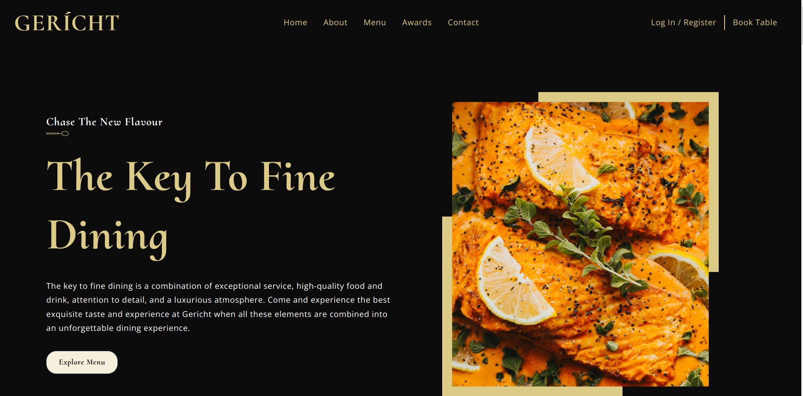

# Gericht



## About The Project

This project illustrates the landing page of a fancy restaurant, with a powerful color scheme and breath-taking design flow. It features a modern, responsive design taken from Figma, showcasing the contemporary and fresh look of current technology.

# Getting Started

## Requirements

- [git](https://git-scm.com/book/en/v2/Getting-Started-Installing-Git)
  - You'll know you did it right if you can run `git --version` and you see a response like `git version x.x.x`
- [Nodejs](https://nodejs.org/en/)
  - You'll know you've installed nodejs right if you can run:
    - `node --version` and get an ouput like: `vx.x.x`
- [React](https://reactjs.org/docs/getting-started.html)
  - You can now create a new React application by typing:
    - `npx create-react-app ./`

# Built With

- [Node.js](https://nodejs.org/en/)
- [Javascript](https://www.javascript.com/)
- [CSS](https://developer.mozilla.org/en-US/docs/Web/CSS)

## Setup

Clone this repo

```
git clone https://github.com/vaasanthk/gericht_restaurant.git
cd GPT3_landingpage
```

```
 npm start
```

You should see the React logo and a link to "Learn React" on http://localhost:3000 in your browser.

Deployed the site on vercel below is the link:

<!-- <a href="https://gpt-3-landingpage.vercel.app/" target="_blank">Gericht</a> -->

# Thank you!
